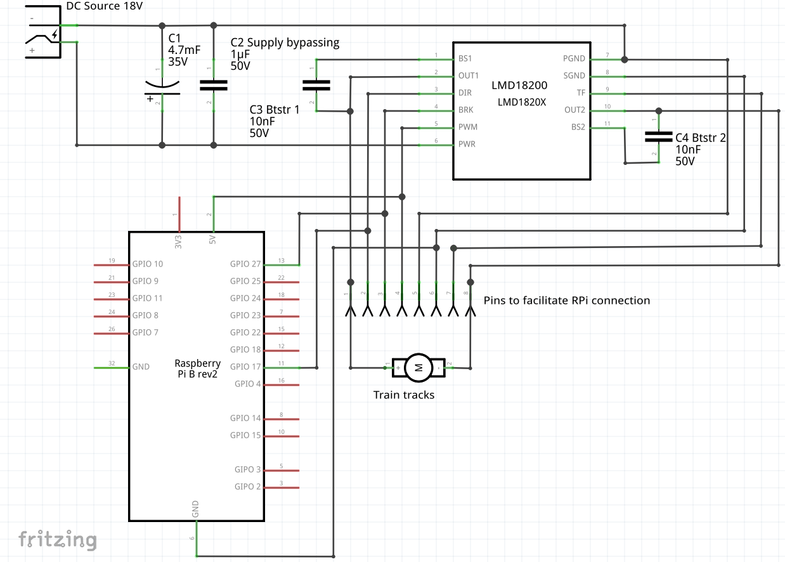

NRMA Digital Command Control (DCC) implementation for Raspberry Pi
==================================================================

This module implements the DCC protocol for controlling model trains using a Raspberry Pi.

It is able to output direction and speed DCC-encoded packets on one of the GPIO pins (see example below).

It is based on the:
  * [S-91 Electrical Standard](http://www.nmra.org/sites/default/files/standards/sandrp/pdf/s-9.1_electrical_standards_2006.pdf)
  * [S-92 DCC Communications Standard](http://www.nmra.org/sites/default/files/s-92-2004-07.pdf)

Index
-----

  * [Features](#features)
  * [Hardware requirements](#hardware-requirements)
  * [Software requirements](#software-requirements)
  * [Installation](#installation)
  * [Usage](#usage)
  * [Example](#example)
  * [License](#license)

Features
--------

> You wanted a banana but what you got was a gorilla holding the banana and the entire jungle.

> Joe Armstrong

`dccpi` is a minimal implementation which aims to offer support to control some trains and be easy to integrate in other projects. It is not a support-all, complex, multi-protocol, ui-included, buy-my-hardware solution. For this, there are better solutions like [RocRail](http://wiki.rocrail.net/doku.php), [JMRI](http://jmri.sourceforge.net/), [SPROG](http://www.sprog-dcc.co.uk/), [GertBot](http://www.gertbot.com/) etc.


  * Easy to install and use (pip module, minimal setup, no big framework)
  * Easy to integrate as building block
  * Should works on multiple RPi operating systems
  * Control DCC locomotives using plain Python!
  * Set speed (14, 28, 128 speed steps) and direction
  * Set FL (lights), F1-F4 functions

Note dccpi does not yet implement any advanced features like decoder registry operations (i.e. set address). I will work to extend it to my needs, which are not too fancy.

Hardware requirements
---------------------

  * A Raspberry Pi (developed/tested on model B+)
  * DCC-decoder-equipped locomotives and tracks.
  * The Raspberry Pi needs an additional booster circuit to actually provide the signal to the tracks which you can build yourself. See below.

`dccpi` should work on any common scale. DCC decoders take a wide range of voltage outputs (up to 24v). This has been tested on N-scale with a 18v booster circuit.

### Booster circuit

Here is an example booster using [LMD18200 H-Bridge from TI](http://www.ti.com/product/LMD18200):



These are the parts:

  * [1x 1µF Ceramic Capacitor 50Vdc ±20% , Multilayer](http://www.conrad.com/ce/en/product/453382)
  * [1x Electrolytic capacitor 4700 µF 35 V 20 %](http://www.conrad.com/ce/en/product/441958)
  * [2x 10nF Ceramic Capacitor 50Vdc % 5mm Holystone](http://www.conrad.com/ce/en/product/531889)
  * [1x DC Barrel Jack Adapter Breadboard Compatible](http://www.exp-tech.de/dc-barrel-jack-adapter-breadboard-compatible)
  * [1x LMD18200T/NOPB Texas Instruments](http://www.ti.com/product/LMD18200/samplebuy)

Here is an image composed of 5 pictures of how my actual working prototype looks like: [prototype.jpg](prototype.jpg)

Note that the circuit in the pictures includes an additional 5V DC converter (the black chip with 3 legs) and some resistors which are not necessary nor play any part.


Software requirements
---------------------

  * Python 2.7/Python 3
  * `bitstring` module [details](https://pypi.python.org/pypi/bitstring/3.1.3). Should be auto-fetched when installing with pip.
  * `wiringPi`: download and install [wiringPi](http://wiringpi.com/download-and-install/)
  * Since `wiringPi` uses low-level mechanisms to access pins, dccpi programs **must be run as root**

Installation
------------

From PyPI:

`sudo pip install dccpi`

From Source:

`sudo python setup.py install`

Usage
-----

There are 3 main componenents:

  * `DCCLocomotive`: represents a locomotive (device equipped with a DCC decoder). We can set speed, status of lights etc.
  * `DCCController`: represents the command station, that can be turned on/off. When it's on, it sends packets using a DCCEncoder.
  * `DCCRPiEncoder`: it implements methods to actually send packets. The RPi encoder uses a c-extension based on WiringPi to do it. It should be easy to add other encoders (for example for different platforms than the RPi or based on other extensions).

The Raspberry Pi will output the signal (which goes from 0v-Low to 3.3v-High) on BCM GPIO pin 17, which is Physical Pin 11 (Model B+), which is wiringPi pin 0. The booster is in charge of converting this signal into the DCC signal ranges (i.e. 18v to -18v).

The Raspberry Pi will also output a brake signal (HIGH) when the controller is stopped on BCM GPIO pin 27, which is Pysical Pin 13 (Model B+), which is wiringPi pin 2 (so next to the one above). This can be used to stop signal on the tracks if your booster supports it (see booster schematics). Otherwise locos will receive DC current directly, and either burn or turn into DC mode (at full speed).

See example below and read the code for more info.

Example
-------

Note that `dccpi` programs must be run as root, or `wiringPi` will complain.


```
from dccpi import *
e = DCCRPiEncoder()
controller = DCCController(e)  # Create the DCC controller with the RPi encoder
l1 = DCCLocomotive("DCC6", 6)  # Create locos, args: Name, DCC Address (see DCCLocomotive class)
l2 = DCCLocomotive("DCC7", 7)
l3 = DCCLocomotive("DCC8", 8)
controller.register(l1)        # Register locos on the controller
> DCC6 registered on address #6
controller.register(l2)
> DCC7 registered on address #7
controller.register(l3)
> DCC8 registered on address #8
controller.start()             # Start the controller. Removes brake signal
> Starting DCC Controller      # and starts sending bits to the booster
l1.reverse()                   # Change direction bit
l2.fl = True                   # Change fl function bit
l3.fl = True
l1.speed = 10                  # Change speed
l2.speed = 18
l3.speed = 23
l3.slower()                    # Reduce 1 speed step
l3.faster()                    # Increase 1 speed step
l1                             # Print loco information

DCC locomotive
> Name:               my
> Address:            6
> Speed:              10
> Speed steps:        28
> Direction:          0
> FL, F1, F2, F3, F4: [0 0 0 0 0]

controller                     # Print info from all locos registered
> DCC Controller:
> -----------------------------
> DCC locomotive
> Name:               my8
> Address:            8
> Speed:              23
> Speed steps:        28
> Direction:          1
> FL, F1, F2, F3, F4: [1 0 0 0 0]
> -----------------------------
> DCC locomotive
> Name:               my2
> Address:            7
> Speed:              18
> Speed steps:        28
> Direction:          1
> FL, F1, F2, F3, F4: [1 0 0 0 0]
> -----------------------------
> DCC locomotive
> Name:               my
> Address:            6
> Speed:              10
> Speed steps:        28
> Direction:          0
> FL, F1, F2, F3, F4: [0 0 0 0 0]
> -----------------------------
 
controller.stop()              # IMPORTANT! Stop controller always. Emergency-stops
> DCC Controller stopped       # all locos and enables brake signal on tracks
```


Example with dummy encoder
--------------------------

Same as above but pass `DCCDummyEncoder()` to the controller. The Dummy Encoder will print information to the screen every 10 seconds on what packages are sent and to who, but leave GPIO outputs alone.

License
-------

GPLv3. See `LICENSE`.
